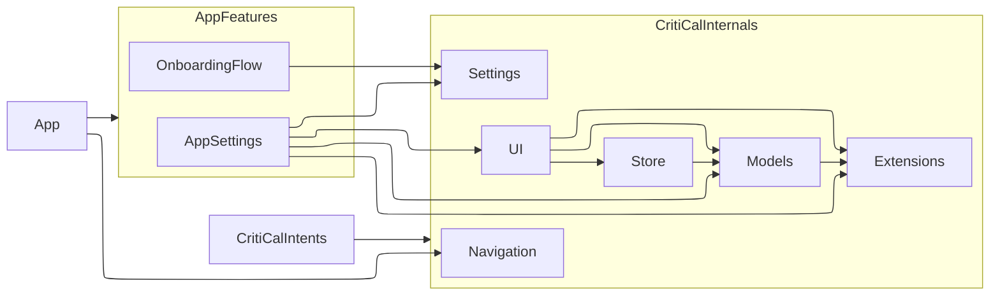

# CritiCal Package Architecture

This document provides an overview of the modular Swift Package Manager (SPM) architecture used in the CritiCal application.

## Package Overview

The CritiCal application is built using a clean architecture pattern with separate Swift packages for different layers of functionality:

```
CritiCal App
├── CritiCalModels     (Core data models and detached types)
├── CritiCalStore      (SwiftData persistence implementation)
├── CritiCalUI         (SwiftUI presentation layer)
└── CritiCalIntents    (App Intents for system integration)
```

## Dependency Graph

For convenience, the CritiCal internal packages are listed without the `CritiCal...` prefix.



## Package Responsibilities

### CritiCalModels
**Foundation Layer**
- SwiftData models (`Event`, `Genre`) for persistence
- Detached types (`DetachedEvent`, `DetachedGenre`) for actor boundary crossing
- Core enums (`ConfirmationStatus`) used across the application
- Repository protocols (`EventReading`, `EventWriting`, `GenreReading`, `GenreWriting`)
- **Dependencies**: CritiCalExtensions (for color utilities)

### CritiCalStore
**Data Persistence Layer**
- Repository implementations using SwiftData ModelActors
- CloudKit sync integration for data synchronization
- Time-based querying and search capabilities
- Thread-safe concurrent access patterns
- **Dependencies**: CritiCalModels (protocols and data types)

### CritiCalUI
**Presentation Layer**
- Reusable SwiftUI components (`EventRow`, `EventListView`, `EventDetailView`)
- Styling utilities and custom label styles
- Preview support with mock repositories
- Direct SwiftData integration via `@Query`
- **Dependencies**: CritiCalModels (protocols and data types)

### CritiCalIntents
**System Integration Layer**
- App Intents for Siri and Shortcuts integration
- Entity representations (`EventEntity`, `GenreEntity`)
- System-level event querying and display
- SwiftUI snippet views for intent results
- **Dependencies**: CritiCalModels, CritiCalStore

## Key Architecture Patterns

### Repository Pattern
Protocols defined in CritiCalModels provide clean separation between business logic and data access:
```swift
protocol EventReading {
    func recent(limit: Int) async throws -> [DetachedEvent]
}

@ModelActor
class EventRepository: EventReading {
    // SwiftData implementation in CritiCalStore
}
```

### Detached Event Architecture
Actor-safe data passing using detached copies:
```swift
// In ModelActor context
let event: Event = // SwiftData model
let detached = event.detached() // Safe to pass across actors

// Repository returns detached types
func recent(limit: Int) async throws -> [DetachedEvent]
```

### Dependency Injection
Repository access via environment and protocols:
```swift
@Environment(\.eventReader) private var reader
let events = try await reader.recent(limit: 10)
```

## Architecture Benefits

This streamlined architecture provides:

- **Direct data flow**: DetachedEvent types used throughout, eliminating DTO conversion overhead
- **Type safety**: SwiftData models and detached types provide compile-time guarantees
- **Concurrency compliance**: Full Swift 6.2 strict concurrency checking
- **Actor safety**: Detached types safely cross actor boundaries

## Testing Architecture

Each package maintains comprehensive test coverage:
- **Unit Tests**: Repository operations, entity conversions, intent execution
- **Integration Tests**: Cross-package functionality and data flow
- **Mock Providers**: Isolated testing with fake repositories

This modular architecture enables:
- **Clear separation of concerns** across application layers
- **Independent development and testing** of each component
- **Flexible deployment** and feature development
- **Strong type safety** with Swift 6.2 concurrency compliance
- **Maintainable codebase** with explicit dependencies and contracts
